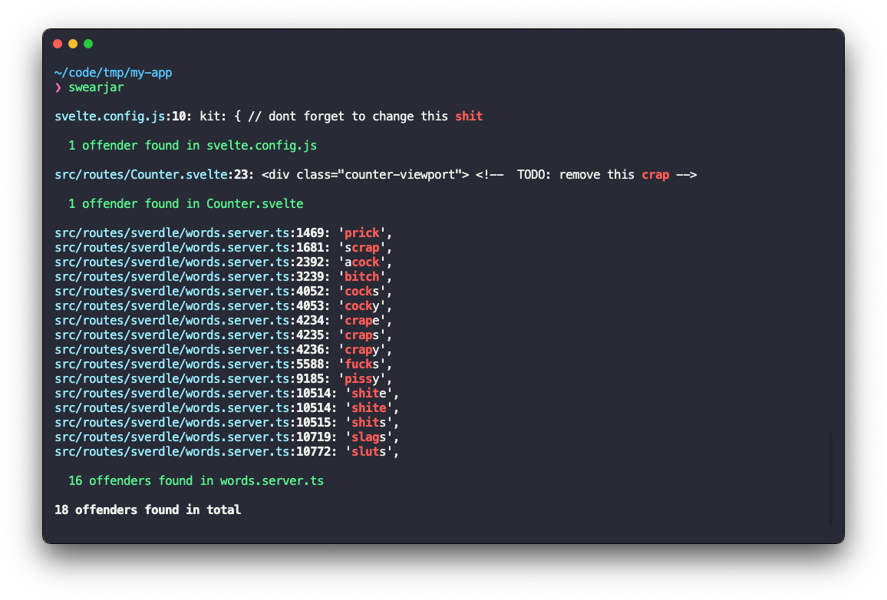

<h1 align="center">SwearJar</h1>
<p align="center">⚡ Static analysis tool that scans your code for swear words</p>
<!-- <p align="center">
  <a href="https://travis-ci.org/cesarferreira/drone"></a>
  <a href="https://www.npmjs.com/package/drone"></a>
  <a href="https://www.npmjs.com/package/drone"></a>
  <a href="https://github.com/cesarferreira/drone/blob/master/LICENSE"></a>
</p> -->


<p align="center"></p>

<!-- > Static analysis tool that scans files for swear words. It checks all files within the directory it's run from and all subdirectories for any matches against a predefined list of swear words. -->

## Features

- Recursive directory scanning
- Case-insensitive swear word matching
- Highlighting of swear words within the text
- Ability to command+click the offending line
- Summary of findings with counts per file and total
- Ability to ignore certain directories and file types

## Usage

After installation, you can use the tool by simply typing `swearjar` in the terminal, within any directory you want to scan:

```bash
swearjar
```

## Install

To install this tool on your system, follow these steps:

1. Ensure you have `Python 3.x` installed on your system.
2. Clone the repository to your local machine.
3. Navigate to the root directory of the project.
4. Run the `install.sh` script with the following command:

```bash
./install.sh
```

## Requirements

- Python 3.x
- Terminal that supports ANSI escape sequences for colored output

## Created by
[Cesar Ferreira](https://cesarferreira.com)

## License
MIT © [Cesar Ferreira](http://cesarferreira.com)
